# 就活ノート・就活記録アプリ「就集」

## 目次 <!-- omit in toc -->

- [1. 概要](#1-概要)
- [2. 背景・目的](#2-背景目的)
- [3. 機能仕様](#3-機能仕様)
  - [3.1. 企業管理機能](#31-企業管理機能)
    - [3.1.1. 概要](#311-概要)
    - [3.1.2. 構成機能](#312-構成機能)
    - [3.1.3. 機能使用時のスクリーンショット](#313-機能使用時のスクリーンショット)
  - [3.2. 企業の基本情報管理機能](#32-企業の基本情報管理機能)
    - [3.2.1. 概要](#321-概要)
    - [3.2.2. 構成機能](#322-構成機能)
    - [3.2.3. 機能使用時のスクリーンショット](#323-機能使用時のスクリーンショット)
  - [3.3. 企業との接触情報管理機能](#33-企業との接触情報管理機能)
    - [3.3.1. 概要](#331-概要)
    - [3.3.2. 構成機能](#332-構成機能)
    - [3.3.3. 機能使用時のスクリーンショット](#333-機能使用時のスクリーンショット)
  - [3.4. 今後実装予定の機能一覧](#34-今後実装予定の機能一覧)
- [4. 開発仕様](#4-開発仕様)
  - [4.1. 設計資料](#41-設計資料)
    - [4.1.1. 画面設計](#411-画面設計)
      - [4.1.1.1. 企業の一覧画面](#4111-企業の一覧画面)
      - [4.1.1.2. 企業の詳細画面](#4112-企業の詳細画面)
      - [4.1.1.3. 企業の基本情報閲覧画面](#4113-企業の基本情報閲覧画面)
      - [4.1.1.4. 企業との接触情報閲覧画面](#4114-企業との接触情報閲覧画面)
      - [4.1.1.5. 情報の登録/編集フォーム・ダイアログ（フォームによって項目が変わる）](#4115-情報の登録編集フォームダイアログフォームによって項目が変わる)
      - [4.1.1.6. 情報の削除確認ダイアログ](#4116-情報の削除確認ダイアログ)
    - [4.1.2. ER図](#412-er図)
    - [4.1.3. テーブル定義](#413-テーブル定義)
    - [4.1.4. アーキテクチャ](#414-アーキテクチャ)
    - [4.1.5. クラス図](#415-クラス図)
  - [4.2. 使用技術](#42-使用技術)
  - [4.3. ソースコード構成](#43-ソースコード構成)
  - [4.4. セットアップ](#44-セットアップ)
  - [4.5. ビルド＆起動](#45-ビルド起動)
  - [4.6. アプリへのアクセス](#46-アプリへのアクセス)
  - [4.7. データベースへのアクセス](#47-データベースへのアクセス)
  - [4.8. 停止＆破棄](#48-停止破棄)

## 1. 概要

これは、就活生が就活情報を収集・集約するためのWebアプリケーションである。企業情報、その企業の社員との接触情報（5W1H）、提出した書類・提供した情報(発言などを含む)、スケジュールをまとめて管理できるようになるのが最終的な目標である。

## 2. 背景・目的

概要であげたような就活情報は、自分で上手く管理できていないと、情報が散乱したり、忘れたりしてしまい、この話はしたことあったっけ？といったように混乱してしまう。そこで、それらの情報を集約させ、管理しやすくすることで、就活を効率的に進められるようにするために、このアプリを開発した。

## 3. 機能仕様

本章では、アプリの仕様について記載している。3.1~3.3では、今回の演習で実装した機能について、3.4では、今後実装する予定の機能の一覧を示す。

### 3.1. 企業管理機能

#### 3.1.1. 概要

企業(名)を登録し、登録した企業の基本情報の管理機能や企業との接触情報の管理機能が使えるようになる。

#### 3.1.2. 構成機能

本機能は以下の機能によって構成される。

- 一覧表示
- 登録
- 削除
- 詳細表示

#### 3.1.3. 機能使用時のスクリーンショット

本機能を使用した際のスクリーンショットを以下に示す。

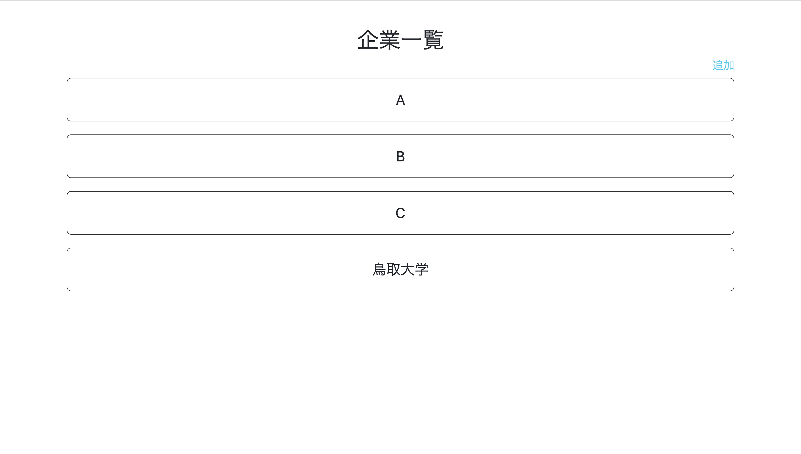
*図: 企業の一覧表示機能（スクリーンショット）*

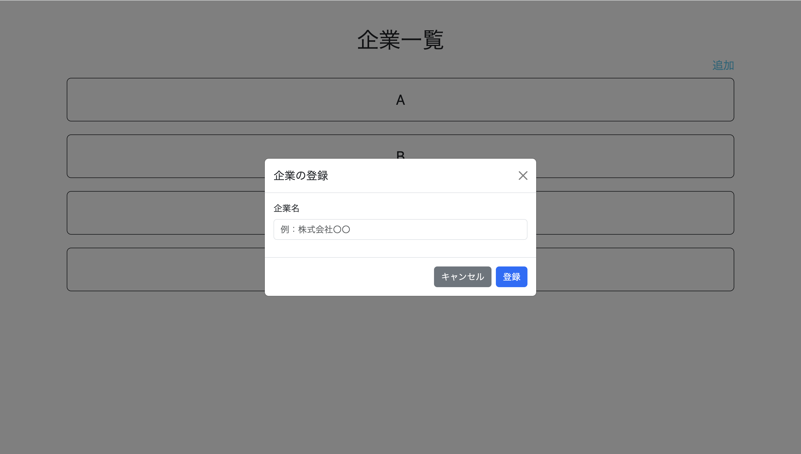
*図: 企業の登録機能（スクリーンショット）*

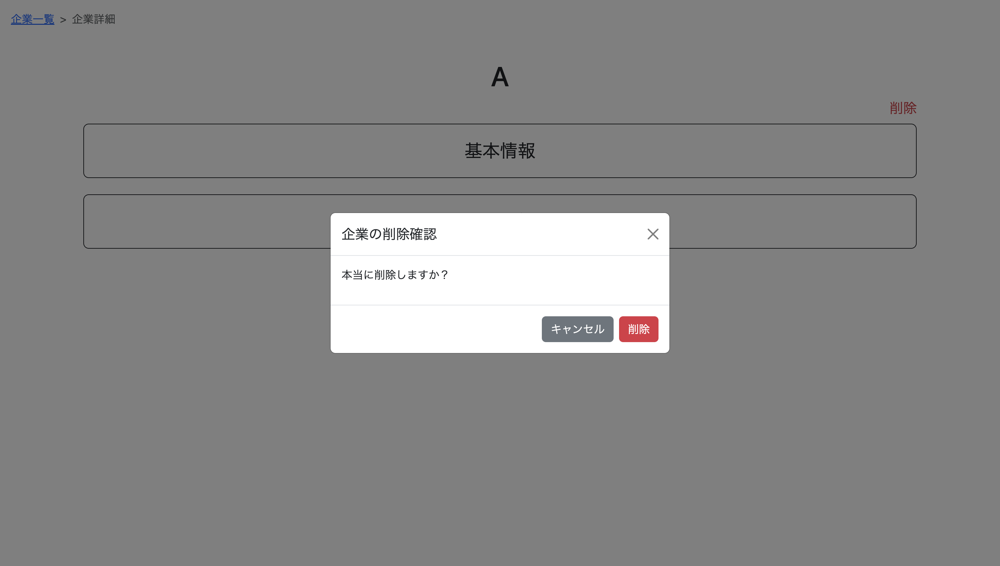
*図: 企業の削除機能（スクリーンショット）*

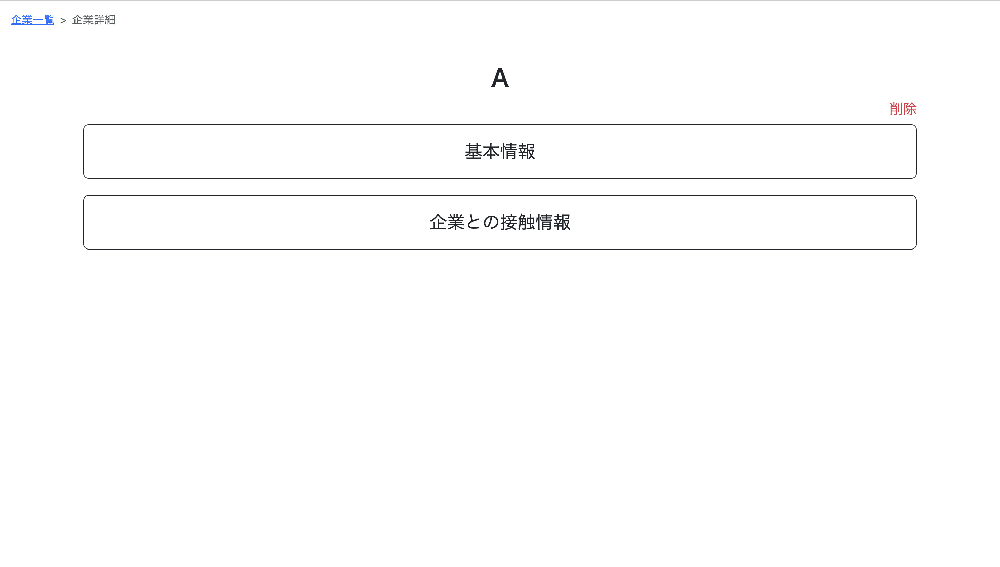
*図: 企業の詳細表示機能（スクリーンショット）*

### 3.2. 企業の基本情報管理機能

#### 3.2.1. 概要

以下のような、企業の基本的な情報を管理することができる。

- 事業内容
- 経営理念・ミッション・バリュー・パーパス
- 求められるスキル
- 勤務地（本社の所在地、支社など）
- 福利厚生・社内制度
- 志望動機

#### 3.2.2. 構成機能

本機能は以下の機能によって構成される。

- 表示
- 編集

#### 3.2.3. 機能使用時のスクリーンショット

### 3.3. 企業との接触情報管理機能

#### 3.3.1. 概要

以下のように、企業と、いつ・どこで・だれと・どうやって接触し、何をしたのかという接触情報を管理することができる。

- 日付
- 接触方法（カジュアル面談、OB訪問、就活イベント、選考など）
- 担当者・接触した社員の情報
- 内容
- 経由（リクナビ、マイナビ、大学、研究室の教授など）

#### 3.3.2. 構成機能

本機能は以下の機能によって構成される。

- 一覧表示
- 登録
- 編集
- 削除

#### 3.3.3. 機能使用時のスクリーンショット

### 3.4. 今後実装予定の機能一覧

- 定形情報の管理機能（自己紹介、自己PR、ES、ガクチカなど）
- 求人情報の管理機能（職種、給与など）
- リンクの管理機能（公式HP、採用ページなど）
- 提出物の管理機能（ES、履歴書、コーディングテストなど）
- スケジュール管理機能（Googleカレンダー等の他アプリとの連携 or このアプリ内で完結）
- データ公開機能

## 4. 開発仕様

本章では、前章であげた今回の演習で実装した機能、そして、本アプリを開発するにあたっての仕様を説明する。

### 4.1. 設計資料

本節では、本アプリを設計する際に作成した資料を示す。

#### 4.1.1. 画面設計

##### 4.1.1.1. 企業の一覧画面

本画面は以下の要件を満たす。イメージ図を下記に示す。

- 登録してある企業名が書かれたボタンが列挙されている。
- 企業を追加するフォームを表示するテキストリンクがある。
- 各企業のボタンを押すと、企業の詳細画面へ遷移する。

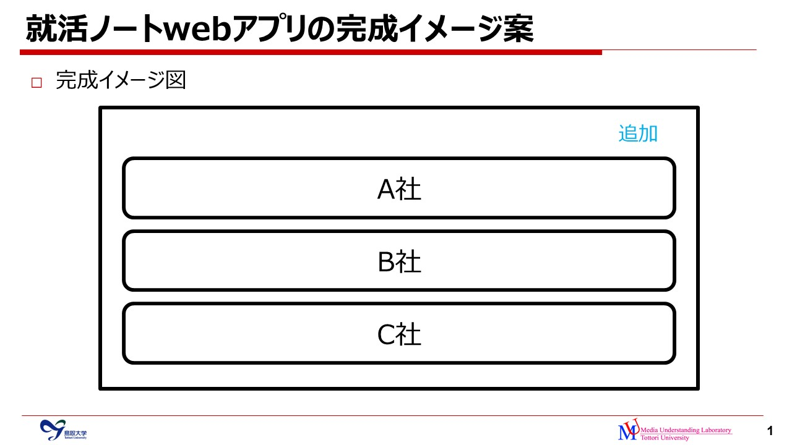
*図: 企業の一覧画面のイメージ図*

##### 4.1.1.2. 企業の詳細画面

本画面は以下の要件を満たす。イメージ図を下記に示す。

- 基本情報や企業の接触情報など、より詳細な情報が見れる画面に遷移するボタンが列挙されている。
- 企業を削除するフォームを表示するテキストリンクがある。
- 各ボタンを押すと、対応する画面へ遷移する。

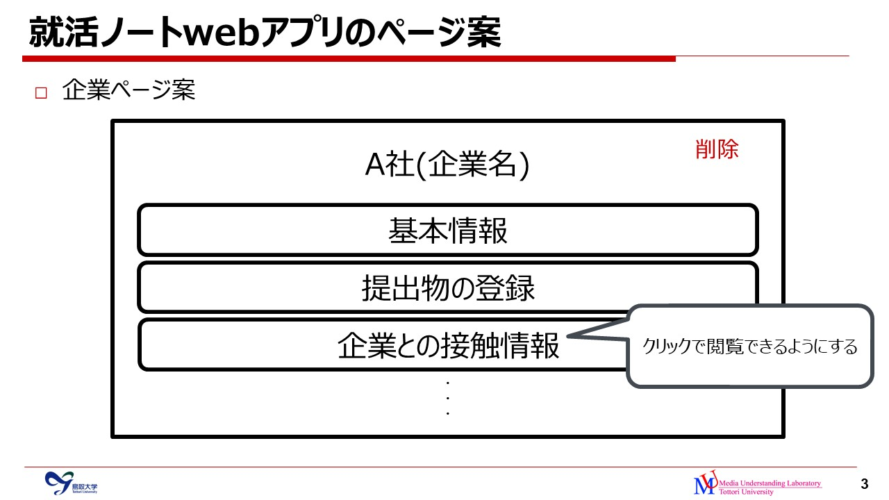
*図: 企業の詳細画面のイメージ図*

##### 4.1.1.3. 企業の基本情報閲覧画面

本画面は以下の要件を満たす。イメージ図を下記に示す。

- 企業名が一番上に表示されいる。
- 企業の基本情報がタイトル＋文章で表示されている。
  - 事業内容
  - 経営理念・ミッション・ビジョン・バリュー・パーパス
  - 求められるスキル
  - 勤務地（本社の所在地、支社など）
  - 福利厚生・社内制度
  - 志望動機
- 企業の基本情報を編集するフォームを表示するテキストリンクがある。

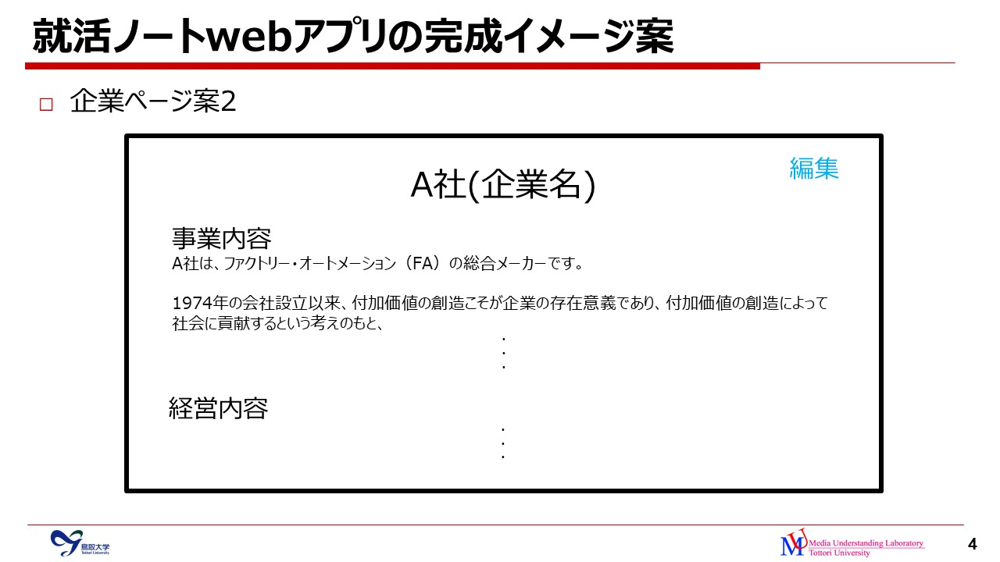
*図: 企業の基本情報閲覧画面のイメージ図*

##### 4.1.1.4. 企業との接触情報閲覧画面

本画面は以下の要件を満たす。

- 企業との接触情報が下記の表ような形式で表示されている。
  - 日付
  - 接触方法
    - カジュアル面談
    - OB訪問
    - 就活イベント（合同説明会など）
    - 選考
  - 担当者・接触した社員の情報
  - 内容
  - 経由（リクナビ、マイナビ、大学、研究室の教授など）
  - 企業との接触情報を編集するフォームを表示するテキストリンク
  - 企業との接触情報を削除する確認ダイアログを表示するテキストリンク
- 企業との接触情報を追加するフォームを表示するリンクがある。

表: 企業との接触情報閲覧画面における表の例
| 日付 | 接触方法 | 担当者・接触した社員の情報 | 内容 | 経由 |  |  |
| --- | --- | --- | --- | --- | --- | --- |
| 1/1 | カジュアル面談 | 山田太郎さん、バックエンドエンジニア、A事業部 | 良かった。 | リクナビ | 編集 | 削除 |
| 1/2 | OB訪問 |  | 楽しかった。 | 大学 | 編集 | 削除 |

##### 4.1.1.5. 情報の登録/編集フォーム・ダイアログ（フォームによって項目が変わる）

本フォーム・ダイアログは以下の要件を満たす。イメージ図を下記に示す。

- 各項目の項目名とテキストフォームが表示されている。
- Submit(登録or更新)ボタンとキャンセルボタンが表示されている。
- Submitボタンを押すと、以下のように遷移する。
  - 企業の追加→企業の詳細画面
  - 企業の基本情報編集→企業の基本情報閲覧画面
  - 企業との接触情報追加→企業との接触情報閲覧画面

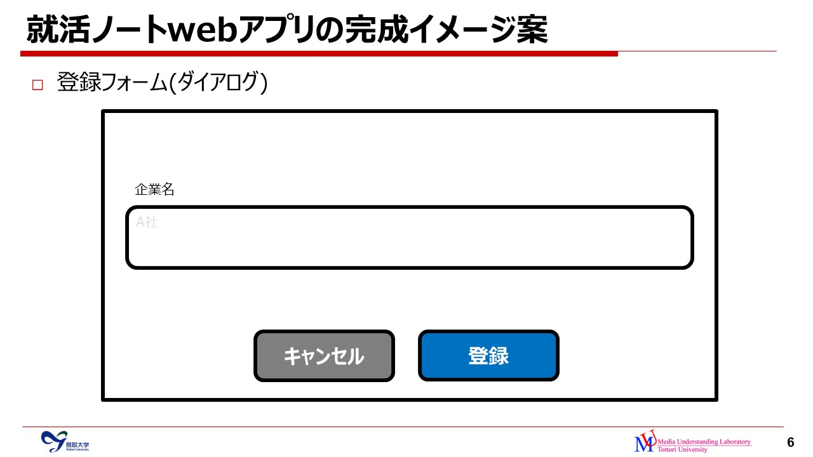
*図: 企業を追加・登録するフォーム（ダイアログ）のイメージ図*

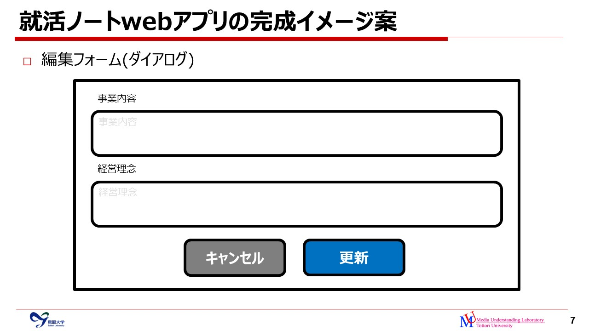
*図: 企業の基本情報を編集するフォーム（ダイアログ）のイメージ図*

##### 4.1.1.6. 情報の削除確認ダイアログ

- 削除確認の文言が表示されている。
- 削除ボタンを押すと、以下のように遷移する。
  - 企業の削除→ホーム（企業の一覧）画面
  - 企業との接触情報削除→企業との接触情報閲覧画面

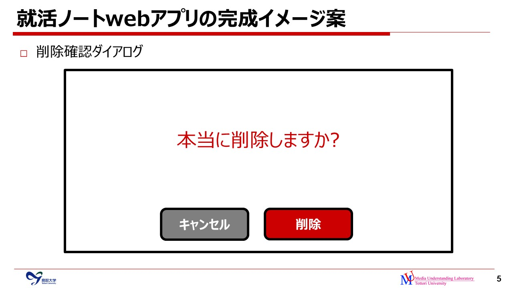
*図: 企業の削除確認ダイアロのイメージ図*

#### 4.1.2. ER図

演習で実装した機能に関するER図を下記に示す。companyテーブルは企業情報を、company_connectionテーブルは企業との接触情報を管理するためのテーブルである。

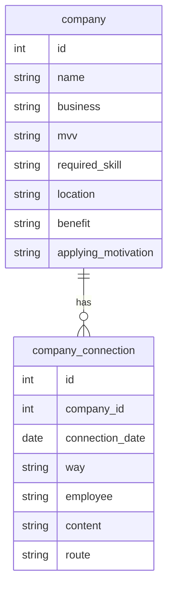

図: 演習で実装した機能に関するER図

#### 4.1.3. テーブル定義

前節で示したテーブルについての定義を以下に示す。

表: companyテーブル

| No | 論理名(カラム名) | 物理名(内容) | データ型 | PK | FK | Not Null | Default | Unique |
| --- | --- | --- | --- | --- | --- | --- | --- | --- |
| 1 | id | 企業のID | INT | 〇 |  | 〇 | AUTO_INCREMENT |  |
| 2 | name | 企業名 | VARCHAR |  |  | 〇 |  |  |
| 3 | business | 業務内容 | TEXT |  |  |  |  |  |
| 4 | mvv | 経営理念 | TEXT |  |  |  |  |  |
| 5 | required_skill | 求められているスキル | TEXT |  |  |  |  |  |
| 6 | location | 勤務地(本社の所在地、支社など) | TEXT |  |  |  |  |  |
| 7 | benefit | 福利厚生・社内制度 | TEXT |  |  |  |  |  |
| 8 | applying_motivation | 志望動機 | TEXT |  |  |  |  |  |

表: company_connectionテーブル

| No | 論理名(カラム名) | 物理名(内容) | データ型 | PK | FK | Not Null | Default | Unique |
| --- | --- | --- | --- | --- | --- | --- | --- | --- |
| 1 | id | 接触情報のID | INT | 〇 |  | 〇 | AUTO_INCREMENT |  |
| 2 | company_id | 企業のID | INT |  | 〇 | 〇 |  | 〇 |
| 3 | company_date | 接触日時 | DATE |  |  | 〇 |  |  |
| 4 | way | 接触方法 | TEXT |  |  |  |  |  |
| 5 | employee | 担当者、接触した社員の情報 | TEXT |  |  |  |  |  |
| 6 | content | 内容 | TEXT |  |  | 〇 |  |  |
| 7 | route | 経由 | TEXT |  |  |  |  |  |

#### 4.1.4. アーキテクチャ

アーキテクチャは、「MVC + Service + Repository」を選択した。下記にアーキテクチャに関わるPythonのディレクトリ構成を示す。
viewについては、テンプレートエンジンが担当するので、実装時にはテンプレートエンジン用のディレクトリになっている。

```markdown
app
├─(view)                       画面表示、画面表示のための処理
├─controller                   制御、リクエストマッピング
├─view_model                   表示用のモデル
├─service                      ビジネスロジック（アプリケーションビジネスルール）
├─repository                   データ操作
└─entity                       テーブルと紐づくモデル
```

ここでのビジネスロジックとは、下記のことを指す。（[参考](https://zenn.dev/naoki_oshiumi/articles/0467a0ecf4d56a#serviceはアプリケーションビジネスルール担当)）

- アプリケーションビジネスルール: システムであるがゆえに発生するビジネスルール
- エンタープライズビジネスルール: システムに関係なく存在している業務上のビジネスルール

このアーキテクチャ・ディレクトリ構成を選択した理由としては、以下の通りである。

1. 開発チームが2人のみで、アプリもシンプルで小規模なものなので、他のアーキテクチャだと過剰だと考え、MVCを選択した。
2. 講義の中でもあったように、現代のMVCでは、Controllerが古典MVCにおけるModelの役割（ロジック）も含むことになると思われるが、単一責任の原則(SRP)の観点から、Controllerには複数の役割（ロジック）を持たせたくないと考え、ビジネスロジックの役割をServiceに、データ操作の役割をRepositoryに分割した。
3. テーブルと紐付けるモデルと表示用のモデルは、データと必要な処理が異なるため、これもSRPの観点から別々のクラスに分割した。

#### 4.1.5. クラス図

以下に各機能に関するクラス図を示す。ただし、コンストラクタおよびクラス変数・メンバ変数など、Pythonでの書き方にはなっていないので、実装時とは少し異なっている。また、Controllerにおけるメソッドの返り値は下記に該当する。

- Response: リダイレクト
- str: テンプレートレンダリング

基本的には、前節で示したアーキテクチャに則ったクラス構成になっている。ServiceとRepositoryについては、オープン・クローズドの原則(OCP)の観点から、インターフェースを用意し、それを実装した(具象)クラスには依存させずに、インターフェースに依存させるようにした。

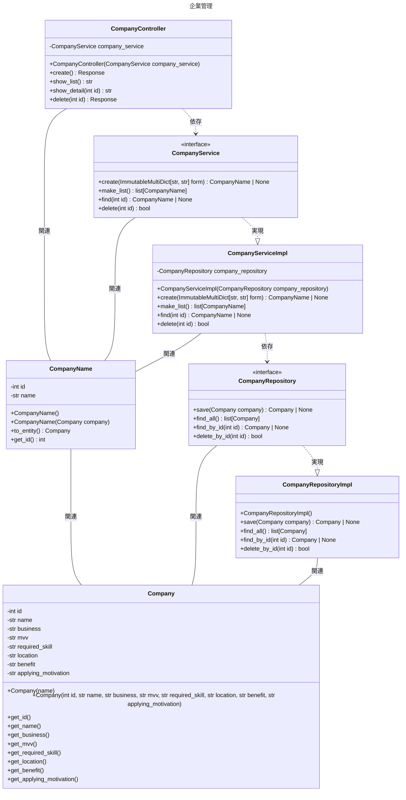

図: 企業管理機能に関するクラス図

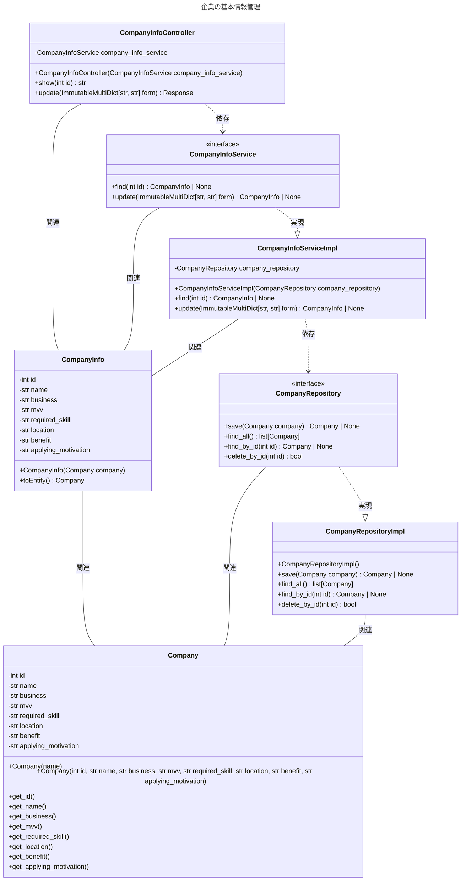

図: 企業の基本情報管理機能に関するクラス図

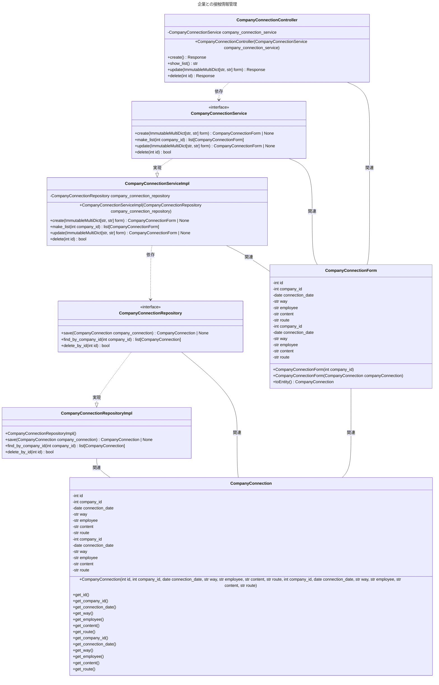

図: 企業との接触情報管理機能に関するクラス図

### 4.2. 使用技術

本アプリを実装するために使用した技術は以下の通りである。

- Bootstrap
- Python
- Flask
- MySQL
- Docker, Docker Compose
- Git, GitHub

### 4.3. ソースコード構成

本アプリのソースコード構成は以下の通りである。

```bash
JobCollection
├── db                                 データベース関連
│   ├── Dockerfile                     MySQL用Docker設定ファイル
│   ├── data                           MySQLのデータ
│   ├── initdb                         コンテナ起動時に実行するSQLファイル群
│   │   ├── 1_schema.sql               テーブル作成用SQLファイル
│   │   └── 2_data.sql                 初期データ登録用SQLファイル
│   └── my.cnf                         MySQL設定ファイル
├── docs                               ドキュメント関連
│   └── pull_request_template.md       プルリクエストのテンプレートファイル
│   python                             Python関連
│   ├── app                            アプリ関連
│   │   ├── config                     設定
│   │   ├── controller                 制御、リクエストマッピング
│   │   ├── view_model                 表示用のモデル
│   │   ├── service                    ビジネスロジック（アプリケーションビジネスルール）
│   │   ├── repository                 データ操作
│   │   ├── entity                     テーブルと紐づくモデル
│   │   ├── static                     静的ファイル群
│   │   │   ├── css                    CSSファイル郡
│   │   │   └── js                     JavaScriptファイル群
│   │   ├── templates                  HTMLファイル郡
│   │   │   ├── ・・・
│   │   │   └── base.html              全HTMLのベースになるHTML
│   │   ├── __init__.py                初期設定
│   │   ├── application.py             Flaskインスタンス管理
│   │   └── database.py                SQLAlchemyインスタンス管理
│   ├── Dockerfile                     Python用Docker設定ファイル
│   └── requirements.txt               pipパッケージ一覧
├── .editorconfig                      コーディングスタイル設定ファイル
├── .gitignore                         Git管理除外対象の設定ファイル
├── docker-compose.yml                 Docker Compose設定ファイル
└── README.md                          ドキュメント
```

### 4.4. セットアップ

本アプリを開発するために必要なツールは以下の通りである。

- [Docker, Docker Compose](https://www.docker.com/)
- Python 3.11
- VSCode拡張機能
  - Python
  - EditorConfig for VS Code

### 4.5. ビルド＆起動

下記のコマンドをCUI上で(カレントディレクトリがプロジェクトルートになっている状態で)打ち込むと、コンテナイメージのビルド、コンテナの作成、アプリおよびデータベースの起動が行われる。

```bash
docker compose build --no-cache  # 2回目以降、ビルドし直したい場合のみ
docker compose up
```

### 4.6. アプリへのアクセス

起動が完了すると、ブラウザでアプリのURL([http://localhost:5001](http://localhost:5001))へアクセスできる。

### 4.7. データベースへのアクセス

起動が完了し、以下のコマンドをCUI上で(カレントディレクトリがプロジェクトルートになっている状態で)打ち込むと、データベースへアクセスできる。

1. docker compose execコマンドを打つと、サーバーに入れる。

    ```bash
    docker compose exec db bash
    ```

2. mysqlコマンドを打つと、パスワードの入力画面が表示される。

    ```bash
    mysql -u docker -p
    ```

3. パスワード「docker」を打つと、MySQL コマンドラインツールが起動し MySQL に接続する。

    ```bash
    Enter password: ******
    ```

### 4.8. 停止＆破棄

下記のコマンドをCUI上で(カレントディレクトリがプロジェクトルートになっている状態で)打ち込むと、アプリおよびデータベースの停止、コンテナの破棄が行われる。

```bash
docker compose down
```
